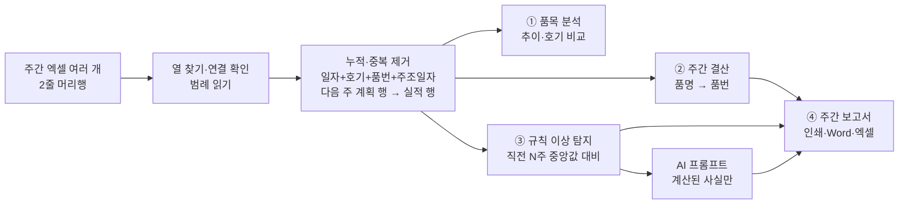

# 주조 생산실적 분석 — 프로젝트 기획서

| 항목 | 내용 |
|---|---|
| 리포 | data09-25 |
| 제출자 | 정윤욱 |
| 직무·소속 | 생산관리팀 — 주조 생산계획 수립, 생산실적 관리, 주간 생산결산 작성 |
| 과정 | 현장 데이터 디지털화 전문가과정 1차수 |
| 작성일 | 2026-09-29 (v0.2 갱신 2026-09-30) |
| 문서 상태 | v0.2 — 수강생 답변(2026-09-29 댓글) 반영: 비가동 코드·요약 피벗 양식·미달 정의·1~6호기·지표 정의 확정, 과거 3~4달 치 한꺼번에 가져오기, AI 프롬프트 품번 가리기(별칭) 기본 켬. 남은 확인: 가동시간 칸·주 번호 규칙(11장) |

이 문서는 제출자가 **메일**로 보낸 기획안(2026-09-29 11:29, `docs/source/메일_접수_원문.md`)과 첨부한 주간 생산실적 엑셀을 과정 기획서 형식(10장)으로 정리한 것입니다.
첨부 엑셀에는 작업자 실명과 실제 품번이 있어 리포에 넣지 않았고, 모양만 `docs/source/엑셀_구조.md` 에 적었습니다.

## 1. 추진 배경과 현안

- 매주 주조 생산실적 엑셀에서 품목별 계획 대비 실적, 작업시간, 양품·폐기, 달성률, 폐기율, 비가동시간, 불량·지연 현황을 **손으로 모아** 주간 생산결산을 만듭니다.
- 품목별 과거 실적을 한눈에 비교하기 어렵고, 평소보다 저조하거나 폐기율·비가동이 늘어난 품목을 **직접 찾아** 분석해야 합니다.
- 바라는 것: 실적을 자동 집계·분석하고, 과거와 비교해 생산성 저하·불량·비가동 증가 품목을 찾아 원인과 확인사항을 제시하는 것.

## 2. 목표

### 2.1 최종 목표 (제출 기획안 4장)

| 번호 | 결과물 |
|---|---|
| ① | 품목별 생산분석 화면 — 품목 선택, 계획 대비 실적, 달성률, 양품률·폐기율, 작업시간·시간당 생산량, 최근 4주/8주 추이, 호기별 생산성 비교 |
| ② | 주간 생산결산 자동화 — 지금 결산표 형태로, 기간을 고르면 작업시간·계획수량·양품·폐기·달성률·폐기율·비가동·불량/지연 현황 자동 집계 |
| ③ | AI 생산분석 — 생산성 저하·폐기율 증가·비가동 증가 품목 자동 탐지와 원인, 품목별 문제 요약, 과거 데이터 기반 확인사항·개선방안 |
| ④ | 주간 생산현황 보고서 자동 생성 |

### 2.2 1단계 목표 (이 리포)

- **지금 쓰는 주간 엑셀을 그대로** 넣으면 되게 합니다. 2줄 머리행(묶음 머리 + 열 머리)을 스스로 찾고, 열 이름이 조금 달라도 연결을 고칠 수 있게 합니다.
- **정확성 기준 = 보내 주신 요약 시트.** 도구가 계산한 주간 합계가 「주조 9월 4주차 요약」과 칸마다 같아야 합니다(로컬 확인 결과 21행 모두 일치 — 6장).
- ③은 **규칙이 먼저**입니다. 도구가 근거 숫자와 함께 이상을 찾고, AI 에게는 그 계산된 사실만 넘겨 요약·확인사항을 부탁합니다(AI 가 숫자를 지어내지 않게).
- 설치 없이 도는 정적 웹, 데이터는 이 브라우저에만 저장(서버로 보내지 않음).

## 3. 보유 데이터

| 데이터 | 형태 | 비고 |
|---|---|---|
| 주간 생산실적 엑셀 | 시트 「주조 ○월 ○주차」 29열, 2줄 머리행 | 일자·호기·품번·품명·계획수량·근무(HR)·초도품·작업(HR)·주조일자·주조호기·작업자·가동시간·총 수량·양품·폐기·비가동 A~J(분)·비가동내용·ERP중량·생산중량·미달수량. 이번 주 행 아래에 **다음 주 계획 행**이 함께 있음 |
| 주간 요약(피벗) | 시트 「주조 ○월 ○주차 요약」 | 품명 → 품번별 계획시간·실투입시간·계획수량·양품·폐기·미달 |
| 비가동 코드 범례 | 원자료 시트 아래 | A 셋팅 시간 ~ K 초도개발, G·I 는 계획정지 — **그대로 사용(확정)** |
| 과거 주간 실적 | 같은 모양의 주간 엑셀들 | **3~4달 치 있음(확정 2026-09-30)** — 한꺼번에 넣으면 됨(11장) |
| 작업일지 · 불량·지연 내용 | 기획안에 언급 | 1단계는 주간표의 비가동내용만 씀. 별도 양식은 받지 못함 |

자세한 열 구성: `docs/source/엑셀_구조.md`.

## 4. 해결 방안 개요

| 단계 | 내용 |
|---|---|
| 읽기 | SheetJS 로 모든 시트를 읽고, 머리행 점수가 가장 높은 시트를 실적 시트로 고름(요약 시트는 품번 열이 없어 빠짐). 머리 위 줄을 묶음 머리로 보고 병합 칸을 오른쪽으로 채워, 「비가동(분)」 아래 한 글자 머리를 비가동 코드 열로 인식 |
| 점검 | 총 수량 = 양품 + 폐기, 미달수량 칸 = 양품 − 계획수량, 숫자가 아닌 값, 양품은 있는데 작업(HR)이 빈 행, 같은 파일 안 중복 행을 경고(반영은 함) |
| 누적 | 같은 행 = 일자 + 호기 + 품번 + 주조일자. 다시 가져오면 새 값으로 바꿈. 주조일자·실적이 빈 「계획만 있는 행」은 같은 일자·호기·품번의 실적 행이 오면 그 행으로 대신함 |
| 기준일 | **주조일자, 없으면 일자.** 실제 파일에서 이 기준이 요약 피벗의 범위(4~29행)와 정확히 같은 26행을 이번 주로 잡음 |
| 지표 (**회사 기준과 같음 — 확정**) | 달성률 = 양품 ÷ 계획수량 · 폐기율 = 폐기 ÷ (양품 + 폐기) · 양품률 = 1 − 폐기율 · 시간당 양품 = 양품 ÷ 작업(HR) · 미달 = 양품 − 계획수량(합계) · 작업 1시간당 비가동(분, 계획정지 제외) |
| 이상 탐지 | 대상 주의 값을 **직전 N주(기본 4) 가운데 그 품목·호기가 생산된 주의 중앙값**과 비교. 직전 생산이 2주 미만이면 비교하지 않고 「기준선 부족」 |

## 5. 주요 기능 — 1단계 / 2단계

| 요청 | 단계 | 1단계에서 한 것 / 미룬 이유 |
|---|---|---|
| 주간 엑셀 가져오기 | **1단계** | 여러 파일 한꺼번에, 끌어다 놓기, **폴더째 고르기**. 하나씩 차례로 읽으며 진행 표시, 잠금 파일(~$)·같은 파일 두 번은 건너뜀. 파일 한눈 표(실적 주·행·알림·상태)와 파일별 자세히(시트·열 연결·경고). **고른 순서와 상관없이 실적이 이른 파일부터 반영**, 한 파일에서 고친 열 연결은 머리행이 같은 파일에 함께 적용. 반영 뒤 **빠진 주 점검**. 1~6호기 밖의 호기 값은 알림 |
| ① 품목별 분석 | **1단계** | 품목·기준 주·추이 기간(4/8/12주) 선택. 계획 → 양품·달성률·양품률/폐기율·시간당 양품 타일, 계획 대 양품 막대, 시간당 양품·달성률·폐기율 꺾은선(각각 따로 — 한 그래프에 두 척도를 섞지 않음), 주별 표, 호기별(실제 주조호기) 시간당 양품·폐기율·비가동, 이번 주 작업 행 |
| ② 주간 생산결산 | **1단계** | 주 또는 날짜 범위. **기본 보기 = 요약 피벗 양식**(행 레이블: 품명 소계 → 품번 → 총합계, 계획시간·실투입시간·계획수량·양품수량·폐기수량·미달수량). 「자세히」 보기에 달성률·폐기율·시간당 양품·비가동 코드별(분)·비가동내용. 엑셀(요약 피벗 양식 · 결산 자세히 · 행 목록), 인쇄 |
| ③ 이상 탐지 (규칙) | **1단계** | 시간당 생산량 −20%, 달성률 −15%p, 폐기율 +3%p(폐기 3개 이상), 작업 1시간당 비가동 +70%(늘어난 비가동 120분 이상) — 모두 화면에서 바꿀 수 있음. 품목과 호기 둘 다 검사하고, 같은 주에 겹치는 이상(예: 4호기 비가동 ↔ 그 호기에서 돈 품목)을 「관련」으로 잇기. 각 항목에 이번 주 값·기준선·비교한 주·비가동 상위 코드·비가동내용 |
| ③ AI 분석 | **1단계(반자동)** | 계산된 사실만 담은 프롬프트(작업자 이름 없음, **품번은 기본으로 「품목1」 같은 별칭 — 대응표는 이 PC 에만, AI 답은 붙여 넣을 때 품번으로 되돌림**) → 회사가 허용한 AI 에 붙여 넣고 답을 다시 붙여 넣음. 선택: 설정에서 OpenAI 호환 주소·모델·본인 키를 넣으면 「설정한 AI 서버로 보내기」(키는 리포에 없음, 기억을 고를 때만 이 브라우저에 저장). 사내 LLM 서버 주소도 넣을 수 있음 |
| ④ 주간 보고서 | **1단계** | 총괄·품명별 실적·주요 문제·호기별 가동·다음 주 계획·AI 의견(붙여 넣은 경우). 인쇄/PDF, Word(.doc), 엑셀(보고서·결산·이상), 글자 복사 |
| 비가동 코드 이름 | **1단계** | 파일의 범례에서 자동으로 읽고, 설정에서 고치기·계획정지 표시 |
| 가상 샘플 | **1단계** | 같은 모양 8주 파일(가짜 품번 SMP-…, 작업자A~F). 7·8주차 4호기 설비 이상 비가동, 8주차 SMP-P202 폐기율 급증을 일부러 심음 → 1~6주차 이상 0건, 7·8주차에 두 이상이 잡힘(테스트로 고정) |
| 팀 공유·기기 간 동기화 | **2단계** | `supabase/schema.sql`(생산 행·비가동·코드·주간 보고서, 본인 행만 RLS)과 로컬 검증 하네스는 준비함 |
| 작업일지·불량 상세 연계 | **2단계** | 작업일지 양식을 받으면 불량 유형·지연 사유를 품목과 이음(10장) |
| AI 원인 분석 고도화 | **2단계** | 과거 같은 이상이 났을 때의 조치 기록을 쌓아 AI 가 참고하게 함(조치 기록 칸이 먼저 필요) |
| 목표값·표준 시간당 생산량 | **2단계** | 지금은 「직전 N주 중앙값」이 기준. 품목별 표준 사이클타임이 있으면 그것과도 비교 |

## 6. 기대 산출물

1. **주조 생산실적 분석(웹, 1단계)** — https://aebonlee.github.io/data09-25/ (「샘플 8주로 시작」으로 바로 둘러볼 수 있음)
2. **로직과 테스트** — `js/logic.js`, `test/logic.test.mjs`(38개): 2줄 머리행 찾기, 열 이름 변형, 필수 열 누락과 수동 연결, 요약 시트 무시, 범례, 날짜(일련번호·Date·글자), 누적·중복·계획 행 대체, 결산 합계, 기준일, 샘플 이상 2종·거짓 경보 0, 기준 바꾸기, 프롬프트, 보고서, 엑셀 왕복
3. **실제 파일 검증(로컬, 값은 리포에 없음)** — 요약 시트 21행(품번 18 · 품명 2 · 총합계 1) × 5개 값 + 행 수 모두 일치
4. **DB 스크립트** — `supabase/schema.sql` + 로컬 검증 하네스(`scripts/sqltest/`)

## 7. 기술 구성

| 과정 도구 | 이 프로젝트에서 쓰는 곳 |
|---|---|
| DAY1 암묵지 자산화·전략기획 | 매주 손으로 하던 결산·이상 찾기 규칙(무엇을 「평소보다 나쁘다」고 보는가)을 숫자 기준으로 적어 둠 |
| DAY2 코랩(Python)·바이브코딩 | 집계·탐지 로직과 화면 제작 — 이 프로젝트의 중심 |
| DAY3 멀티모달 비정형 정보화 | 비가동내용(자유 글)을 코드별로 모아 상위 내용 보여 주기 |
| DAY4 RAG | (2단계 후보) 과거 조치 기록을 찾아 AI 에게 근거로 주기 |
| DAY5 Make 자동화 | (2단계 후보) 매주 공유 폴더에 올라온 주간표를 읽어 보고서 초안을 메일로 |

- 정적 웹(HTML·CSS·일반 스크립트), `index.html` 을 더블클릭해도 열립니다. 엑셀 읽기·쓰기는 `vendor/xlsx.full.min.js`(SheetJS), 그래프는 직접 그린 SVG. 외부 CDN 없음.
- 저장은 localStorage `data09-25.db` 한 칸, AI 연결 설정은 `data09-25.ai`.

## 8. 개발 단계

### 1단계 — 가져오기 + ①~④ (완료, 2026-09-29)

- 주간 엑셀 누적(열 연결·경고·중복 제거), ① 품목 분석, ② 주간 결산(엑셀), ③ 규칙 이상 탐지 + AI 프롬프트(반자동·선택 자동), ④ 보고서 초안(인쇄·Word·엑셀), 가상 샘플 8주, DB 스키마·검증 하네스

### 1단계 보완 — 수강생 답변 반영 (완료, 2026-09-30)

- 요약 피벗 양식 결산(기본 보기·엑셀 첫 시트), 미달 = 양품 − 계획 합계로 확정
- 3~4달 치 한꺼번에 가져오기(폴더째·차례 읽기·반영 순서 고정·열 연결 함께 적용·빠진 주 점검), 품목 추이 16주
- AI 프롬프트 품번 가리기(별칭 + 로컬 대응표 + 답 되돌리기 + 남은 품번 점검), 1~6호기 점검·보고서에 실적 없는 호기

### 2단계 — 공유·연계·고도화

- [ ] 계정 + `supabase/schema.sql` 연결: 팀이 같은 실적·보고서를 봄(작업자 이름은 올리지 않음)
- [ ] 작업일지·불량/지연 양식 연계(양식 확인 후)
- [ ] 이상에 대한 조치 기록 칸 → 다음에 같은 이상이 나면 과거 조치를 함께 보여 주고 AI 근거로 씀
- [ ] 품목별 표준 사이클타임·목표 달성률과의 비교

## 9. 기대 효과

- **주간 결산 시간 단축** — 엑셀을 넣고 기간만 고르면 요약 시트와 같은 합계가 나오고, 비율·비가동까지 한 표에 모입니다.
- **놓치는 품목 줄이기** — 모든 품목·호기를 매주 같은 기준으로 과거와 비교해, 근거 숫자와 함께 목록으로 보여 줍니다.
- **보고서 초안 자동화** — 총괄·문제·호기·다음 주 계획이 채워진 초안에서 시작합니다.

실제 절감 시간은 측정 전이라 적지 않습니다.

## 10. 확인 필요 사항 (수강생께)

> 2026-09-30: 1·2·3·4·5·6·9 는 답을 받아 확정했습니다(11장). **7·8 은 아직 답이 없습니다.**

1. [확정 — 그대로 사용] **비가동 코드 A~K** — 파일 범례(A 셋팅 시간 · B 형치구 이상 · C 설비 이상 · D 자재 대기 · E 작업 대기 · F 기타 작업 · G 회의(계획정지) · H 결근 · I 교육(계획정지) · J 기타 · K 초도개발)를 그대로 읽어 씁니다. 맞나요? K(초도개발)는 범례에만 있고 열이 없는데, 초도품 시간은 어디에 적으시나요? 이상 탐지에서 G·I(계획정지) 말고도 빼야 할 코드(예: H 결근)가 있나요?
2. [확정 — 요약 피벗과 같은 양식] **실제 주간 결산표 양식** — 보내 주신 요약 시트(피벗)와 실제로 보고하시는 결산표가 같은가요? 다르면 양식을 한 부(값은 지워도 됨) 보내 주세요. 칸 배치를 그대로 맞추겠습니다.
3. [확정 — 양품 − 계획] **요약 시트의 「미달수량」** — 피벗 값 설정이 「개수」라서 행 수(총합계 26)가 나오고 있었습니다. 원래 뜻은 양품 − 계획수량의 합(이번 주 −40)이 맞나요? 도구는 수량의 합으로 계산합니다.
4. [확정 — 1~6호기] **호기 목록** — 이번 주 파일에는 1~6호기가 있습니다. 호기가 더 있거나 호기마다 다른 설비(톤수 등)라면 알려 주세요. 호기별 비교를 설비 종류별로 나눌 수 있습니다.
5. [확정 — 3~4달 치] **과거 주간 실적** — 몇 주 치가 같은 모양으로 있나요? 이상 탐지 기준선에 최소 2주, 기본 4주가 필요합니다. 예전 파일의 열 구성이 다르면 한 부 보내 주세요.
6. [확정 — 회사 기준과 같음] **지표 정의** — 달성률 = 양품 ÷ 계획수량, 폐기율 = 폐기 ÷ (양품 + 폐기), 시간당 생산량 = 양품 ÷ 작업(HR)으로 했습니다. 회사 기준(예: 총 수량 기준, 가동시간 기준)이 다르면 알려 주세요.
7. [답 대기] **가동시간 칸** — 분 단위로 보이는데, 가동시간 + 비가동 = 작업(HR) × 60 이 행마다 조금씩 다릅니다. 가동시간은 어떻게 적는 값인가요? (지금은 표시·보관만 하고 계산에는 쓰지 않습니다)
8. [답 대기] **주 번호** — 「9월 4주차」를 그 주 목요일이 속한 달 기준(9/21~27 = 9월 4주차, 9/28~10/4 = 10월 1주차)으로 붙였습니다. 회사 기준과 같나요?
9. [확정 — 품번은 가급적 보내지 않음 → 기본으로 가림] **AI 사용** — 회사에서 쓸 수 있는 AI(외부 ChatGPT·사내 LLM)가 있나요? 1단계는 복사·붙여 넣기가 기본이고, 프롬프트에는 계산된 숫자·품번·비가동내용만 들어갑니다(작업자 이름은 넣지 않음). 품번을 외부 AI 에 보내도 되는지 보안 기준을 확인해 주세요.

## 11. 2026-09-30 반영 — 수강생 답변 (2026-09-29 16:31 댓글)

원문: `docs/source/2026-09-29_패들릿_답변.md`

### 11.1 답과 반영

| 10장 질문 | 답 | 반영 |
|---|---|---|
| 1 비가동 코드 | 그대로 사용 | 확인됨 — 파일 범례를 그대로 읽고, 계획정지는 범례 표시대로 G(회의)·I(교육)만 뺍니다. H(결근)는 비가동으로 셉니다 |
| 2 결산표 양식 | 요약 피벗과 같은 양식(디자인은 달라도 됨) | ② 기본 보기를 **요약 피벗 양식**으로 바꿈 — 행 레이블 한 열(품명 소계 → 품번 → 총합계), 값 6칸(계획시간·실투입시간·계획수량·양품수량·폐기수량·미달수량). 엑셀 첫 시트도 같은 칸. 비율·비가동은 「자세히」 보기와 둘째 시트로 |
| 3 미달 | 양품 − 계획 | 확인됨 — 도구는 처음부터 합계로 계산. 원래 피벗은 값 설정이 「개수」라 행 수가 나오니, 피벗을 계속 쓰신다면 「합계」로 바꾸시면 도구와 같은 값이 나옵니다 |
| 4 호기 | 1~6호기 | 1~6 밖의 호기·주조호기 값은 가져오기에서 알림(오타 방지, 반영은 함). 주간 보고서에 그 주 실적이 없는 호기를 적음 |
| 5 과거 실적 | 3~4달 치 있음 | 아래 11.3 — 한꺼번에 넣도록 가져오기를 다듬음. 품목 추이에 16주 보기 추가. 이상 탐지 기준선(직전 4주)이 처음부터 채워집니다 |
| 6 지표 정의 | 회사 기준과 맞음 | 확인됨 — 바꾸지 않음 |
| 9 외부 AI 와 품번 | 안 보낼 수 있으면 안 보내면 좋겠음 | 아래 11.2 — **품번 가리기를 기본으로 켬** |

### 11.2 AI 프롬프트 품번 가리기

- 프롬프트에 들어가는 품번을 **「품목1」「품목2」… 별칭**으로 바꿉니다. 이상 목록의 품번, 「관련」 문구, 비교 못 한 품번 목록, **비가동내용 글 속의 품번**(예: 「A:(다음 품번) 금형교환(180)」)까지 바꿉니다.
- **대응표는 이 브라우저에만** 저장합니다(`data09-25.db` 의 `aliases`). 같은 품번은 늘 같은 별칭이라, 주가 바뀌어도 AI 와 나눈 이야기를 이어 볼 수 있습니다. 새 품번에만 다음 번호를 붙입니다.
- ③ 화면에 **「별칭 대응표」**(별칭 · 품번 · 품명, 이 프롬프트에 쓴 것만)를 보여 주고, 엑셀에 붙일 수 있게 복사할 수 있습니다. 예:

  | 별칭 | 품번 | 품명 |
  |---|---|---|
  | 품목1 | SMP-B401 | 브래킷 |
  | 품목5 | SMP-M101 | 매니폴드 |
  | 품목9 | SMP-P202 | 파이프 |

  (샘플 8주 기준. 실제 품번은 이 PC 에만 있고 리포·서버에는 없습니다.)
- AI 답을 「AI 답」 칸에 붙여 넣으면 별칭이 **품번으로 되돌아가** 주간 보고서에 들어갑니다. 「설정한 AI 서버로 보내기」도 가린 프롬프트를 보내고 답을 되돌립니다. 「품목 3개」처럼 수를 세는 말은 바꾸지 않습니다.
- **안전망**: 가린 뒤 프롬프트에 실제 품번이 남았는지 가져온 품번 전체와 대조해, 남았으면 경고합니다(샘플에서 0건).
- 한계: 품명(매니폴드·파이프 같은 이름), 수량·시간, 비가동내용의 다른 글은 그대로 들어갑니다. 너무 짧은 품번(3자 이하, 숫자만 5자리 이하)은 코드·분과 헷갈려 비가동내용 글 속에서는 바꾸지 않습니다(품번 칸 자리는 늘 바꿈).
- 끄고 싶으면 ③ 화면의 「품번 가리기」 체크를 끄면 됩니다(사내 LLM 을 쓰는 경우 등).

### 11.3 3~4달 치 한꺼번에 가져오기

- 가져오기 화면에서 **주간 파일을 모두 골라(Ctrl+A) 한 번에** 넣거나, **「폴더째 고르기」**로 폴더를 통째로 넣을 수 있습니다. 끌어다 놓기도 됩니다.
- 파일을 하나씩 차례로 읽으며 「읽는 중 3 / 16」처럼 진행을 보여 줍니다. 엑셀 잠금 파일(~$…)·엑셀이 아닌 파일·이미 올려 둔 같은 파일은 건너뛰고, 못 읽은 파일은 목록으로 남깁니다(나머지는 계속 읽음).
- 파일 한눈 표(실적 주·실적 행·계획 행·알림·상태)를 실적 날짜 순으로 보여 주고, 파일별 자세히는 접어 둡니다(열 연결이 필요한 파일만 펼침).
- **고른 순서와 상관없이 실적이 이른 파일부터 반영**합니다 — 늦은 주의 실적이 앞 주 파일의 「다음 주 계획」 행을 대신하고, 거꾸로 되돌리지 않습니다(테스트: 순서대로·거꾸로·뒤섞어도 같은 결과).
- 옛 파일의 열 이름이 달라 한 파일에서 열 연결을 고치면, **머리행이 같은 나머지 파일에도 똑같이** 적용됩니다.
- 같은 주 실적이 두 파일에 있으면 알려 주고, 같은 행은 한 번만 셉니다. 이미 가져온 파일을 다시 넣어도 행이 늘지 않습니다.
- 반영 뒤 「쌓인 데이터」에 **빠진 주**(첫 주 ~ 마지막 주 사이에 실적이 없는 주)를 보여 줍니다.
- 저장 크기: 한 행이 약 330자라, 17주 치(주당 실적·계획 60행 안팎 → 약 1,000행)도 약 0.3MB 로 브라우저 저장 한도(보통 5MB) 안입니다. 그래도 설정 화면에서 JSON 백업을 받아 두시길 권합니다.

### 11.4 아직 남은 확인

1. **가동시간 칸**(10장 7) — 분 단위로 적는 값인지, 가동시간 + 비가동 = 작업(HR) × 60 이 조금씩 다른 이유. 지금은 표시·보관만 합니다.
2. **주 번호**(10장 8) — 그 주 목요일이 속한 달 기준(9/21~27 = 9월 4주차)이 회사 기준과 같은지.
3. **K(초도개발)** — 범례에만 있고 열이 없습니다. 초도품 시간을 따로 적는 곳이 있으면 알려 주세요. H(결근)는 지금 비가동으로 셉니다(이상 탐지에서도 셈).
4. **옛 파일 열 구성** — 3~4달 전 파일도 지금과 같은 29열인지. 다르면 가져오기에서 한 파일만 열 연결을 고치면 나머지는 따라갑니다.
5. **품명도 가릴지** — 지금은 품번만 가립니다. 품명(매니폴드 등)도 외부에 보내면 안 되면 알려 주세요.

## 부록. 제출 원문 요약

| 출처 | 파일 | 내용 |
|---|---|---|
| 메일 (2026-09-29 11:29, 제목 「[프로젝트 기획안] 정윤욱」) | `docs/source/메일_접수_원문.md` | 1 직무·소속 · 2 현안 · 3 보유 데이터 · 4 희망 결과물 ①~④ |
| 패들릿 댓글 (2026-09-29 16:31, 결과 글에 대한 답) | `docs/source/2026-09-29_패들릿_답변.md` | 10장 질문 1·2·3·4·5·6·9 에 대한 답 |
| 첨부 엑셀 「9-4 주조 생산실적.xlsx」 | 리포에 없음(실명·실제 품번) — `docs/source/엑셀_구조.md` | 원자료 시트(78행 × 29열) + 요약 피벗 시트 |
